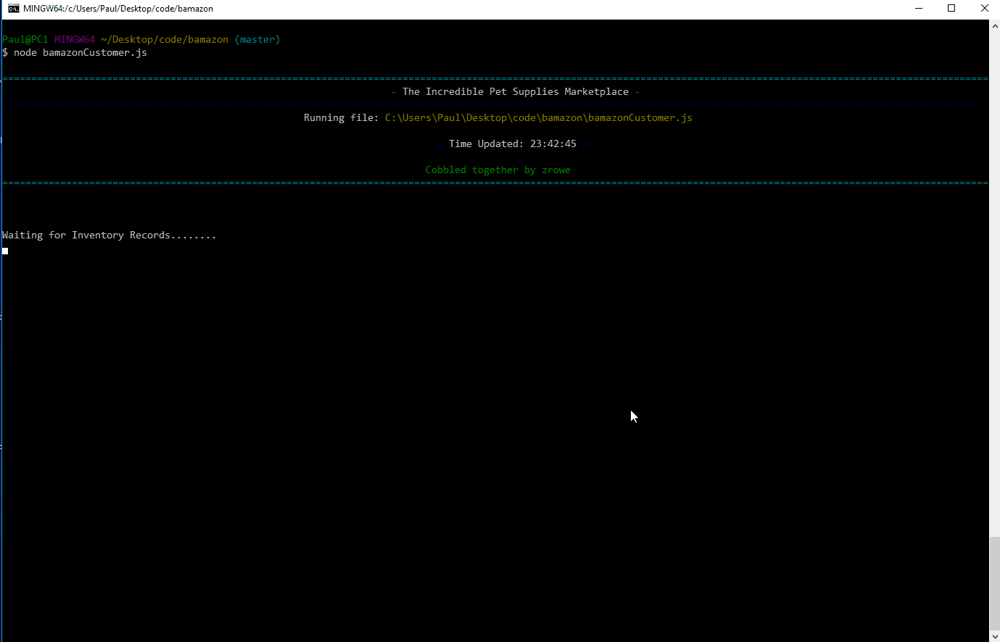
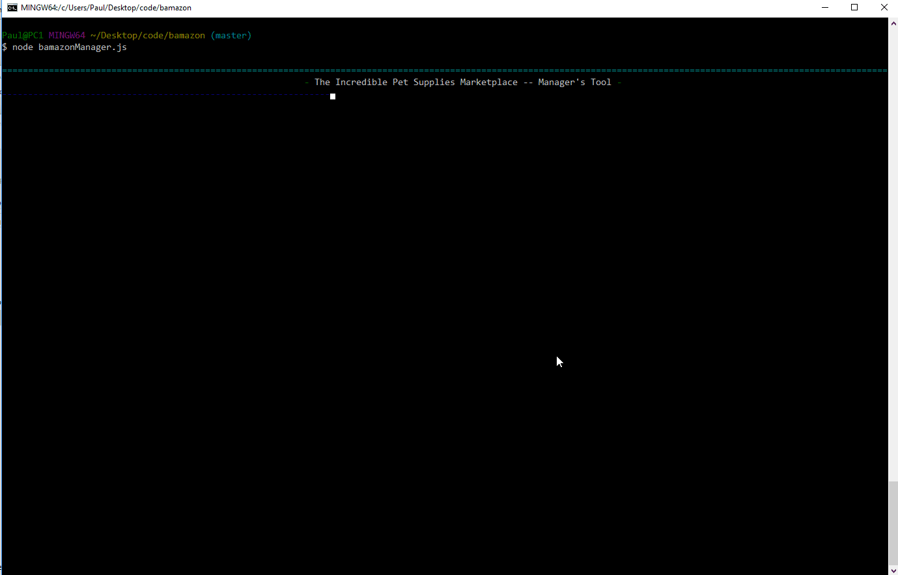

# bamazon

A Node.js &amp; MySQL based Marketplace.  This cli application presents items of an inventory for purchase by a customer.  It includes a 'Manager' tool to update inventory and add additional products.

## Getting Started

To use, just clone down the repo, install the NPM modules, add your sql credentials, and have fun.

### Prerequisites

bamazon was built and tested with MySQL 5.7.20 and the following nodeJS NPM packages:

| NPM Package     | Version |
| --------------- | ------- |
| dotenv          | 5.0.0   |
| cli-table       | 0.3.1   |
| simple-banner   | 1.0.7   |
| inquirer        | 5.1.0   |
| mysql           | 2.15.0  |


You will need to install mySQL (preferably V5.7 or later).  You will want to set a password when you install it.


### Installing

1. Clone the repo to your system.

1. Run `npm install`

1. Create a file named `.env`, add the following to it, replacing the values with your MySQL credentials (no quotes)  This will prevent you from inadvertently loading your credentials into the repo:

```js
# SQL Credentials

SQL_USER=root
SQL_PASSWORD=zyxxyplugh

```


1. Two files are provided to intialize your mySQL database.  Use schema.slq to create the database and tables.  Use seed.sql to populate the tables with test data.  


### Usage

There are two node scripts.  One for the customer and a second one for the manager.


#### Customer View

Usage is `node bamazonCustomer.js`

The user is presented with the list of current products.  Using the product ID, the customer may select a product to purchase and is then asked for a quantity.  The transaction is processed and the amount of the sale presented.  

This cycle iterates until the customer chooses to leave the application by entering a "Q" at any prompt.  




#### Manager View

Usage is `node bamazonManager.js`

The user is presented with a menu of command options:

```
? What would you like to do?? (Use arrow keys)
> View Products for Sale
  View Low Inventory
  Add to Inventory
  Add new Product
  Quit
```

* **View Products for Sale** displays the list of all products
* **View Low Inventory** displays only those products that have fewer than 5 usints remaining in inventory.
* **Add to Inventory** allows the user to enter a quantity to **add** to the current inventory. 
* **Add new Product** allows the user to add a new product to the inventory by entering a product name, department, quantity, and price.

Note that only existing departments can be selected.  TO add departments, one needs to update the departments table via a different application.

Upon completing a transaction, the application returns to the main menu and iterates until the user quits the application.




## Authors

* **Paul Rowe** - *Initial work* - [zrowe](https://github.com/zrowe)


## License

This project is licensed under the MIT License - see the [LICENSE.md](LICENSE.md) file for details

## Acknowledgments

* UC Berkeley Coding BootCamp
* Trilogy
